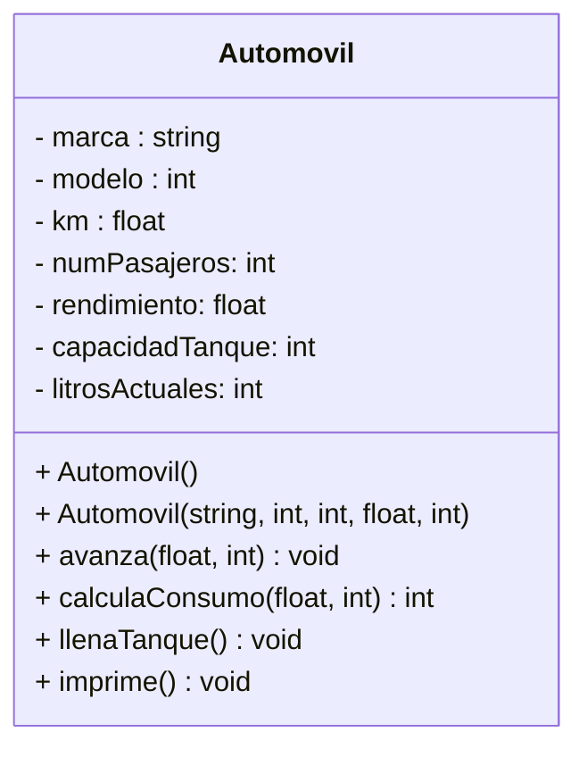

# Ejercicio-Autograding para C++ usando Catch2

**Fuente:** *Learning Autograding with C/C++ and Catch2 - Prof. Igor Machado Coelho* 
https://medium.com/swlh/easy-c-autograding-on-github-classroom-with-catch2-106ad1107402

## Descripción del Problema

La empresa “En Movimiento S.A. de C.V.” que ofrece servicio de transporte hotel-aeropuerto-hotel a las
tripulaciones de las líneas aéreas de un aeropuerto, requiere un sistema computacional que le permita
conocer la disponibilidad de sus unidades. Se maneja información sobre las características de los
automóviles como marca, modelo, año, kilometraje acumulado, número de puertas, color, el número de
pasajeros que pueden viajar, el rendimiento del automóvil en kilómetros por litro, la capacidad en litros
del tanque de gasolina y la gasolina que el automóvil tiene en el momento.
Los requerimientos para su sistema se modelan en el siguiente diagrama de clases y la funcionalidad se
describe más adelante.

## Diagrama de Clases

Construye aquí el Diagrama de Clases de tu solución, usando el [Lenguaje Mermaid](https://mermaid.js.org/syntax/classDiagram.html).

## Notas adicionales:

- **km** es el kilometraje del automovil, al crear el objeto siempre inicia en 0.
- **litrosActuales** es la cantidad de gasolina en tanque, al crear el objeto siempre es 10, ya que es la cantidad que le ponen en fábrica.
- **setLitrosActuales** si recibe un número mayor a la capacidad máxima del tanque, debe actualizarse a la capacidad máxima solamente.
- En el UML no están pero, recuerda que siempre que tus atributos sean privados, **debemos tener los getters y setters de todos los atributos de la clase**.

## Métodos adicionales

A continuación te listo lo que deben hacer todos los métodos adicionales de la clase:

- **avanza(float, int)**: recibe los valores de la distancia en kilómetros que se desea avanzar y el número de pasajeros que pretenden viajar. Este método determinará si el automóvil puede o no avanzar con base en los valores de regreso del método calculaConsumo: para que el automóvil avance, debe haber suficiente gasolina (valor de regreso de calculaConsumo, debe ser mayor o igual a cero).
Si el avance del automóvil es posible, el método desplegará el mensaje “Avance confirmado”, actualizará el valor de kilometraje sumándole la distancia recorrida y restará la gasolina consumida a gasolinaEnTanque. De lo contrario, no modificará ningún atributo y desplegará el mensaje: *“No hay suficiente gasolina”*

- **calculaConsumo(float, int)**: recibe la distancia a recorrer y los pasajeros que viajan en el automóvil. El método calcula la cantidad de gasolina que se requerirían para lograr el avance deseado. Tip. Usa el rendimiento del automóvil (cantidad promedio de kilómetros que recorre un automóvil por cada litro de gasolina).
Si el automóvil va lleno (viajan todos los pasajeros que caben según numPasajeros), agrega 5% extra de consumo de gasolina a lo calculado por el rendimiento; si viajan menos de la mitad de los pasajeros de su capacidad, resta 4% al consumo calculado.
El método regresará la cantidad de litros requeridos para que el automóvil avance (siempre será un entero, redondea al entero superior). Regresará -1 si el automóvil no tiene suficiente gasolina para avanzar o la cantidad de pasajeros excede los que caben.

- **llenaTanque()**: muestra la cantidad de litros de gasolina que requiere el tanque del automóvil para estar lleno. Asigna el valor a gasolinaEnTanque de capacidadTanque. Al final, despliega el letrero “Tanque lleno”.

- **imprimeAutomovil()**: imprime toda la información del automóvil en el formato que más te guste.

## Objetivo

- Crear completa toda la clase Automovil (hpp y cpp).
- Asegúrate que el exercise.cpp trabaje adecuadamente. Puedes agregar tus propias pruebas, a lo que ya está en el archivo, para asegurarte que todo trabaja bajo lo solicitado.
- Busca que el código pase correctamente todas las pruebas
   * Solamente cambia los archivos permitidos para lograr este objetivo (abajo se indican las reglas específicas)
- Las GitHub Actions deberán presentar una palomita en verde si se han satisfecho todas las pruebas, y una cruz roja cuando alguna (o todas) las pruebas han fallado.
   * **Recomendación:** Puedes dar clic en la cruz roja para verificar cual de las pruebas ha fallado (o si el código no ha compilado correctamente).
   * **Recomendación:** En caso de que el Autograding no muestre pruebas o no funcione, contacta a tu profesor mediante un issue.

## Instrucciones

- Deberás modificar SOLAMENTE el archivo `Automovil.hpp` y `Automovil.cpp` también puedes agregar instrucciones en el `excersice.cpp`.

Explicación de los otros archivos:

- Archivo `test/tests.cpp` tiene las pruebas de esta actividad (NO LO CAMBIES!)
- Archivo `test/catch.hpp` tiene la biblioteca de pruebas  CATCH2 (NO LA CAMBIES!)
- Archivo `makefile` tienes los comandos para ejecutar la actividad (NO LO CAMBIES!)
- Archivo  `./build/appTests` se generará después de compilar (para **pruebas locales**, solo ejecútalo)

## Comandos para pruebas locales, ejecución y depuración

- Comando para construir y ejecutar pruebas: `make` o `make test`
    * Si el ejecutable ya está construido, sólo teclea : `./build/appTests`

- Comando para construir y ejecutar la aplicación: `make run` 
    * Si el ejecutable ya está construido, sólo teclea : `./build/exercise`

- Comando para depurar: `make debug`
    * Para conocer los comandos de depuración consulta:
     https://u.osu.edu/cstutorials/2018/09/28/how-to-debug-c-program-using-gdb-in-6-simple-steps/
     
- Comando para depurar con `vsCode` en `GitPod`: `make debugvs` 
    * Utilizar el depurador de la IDE.     

## Notas

- El código será evaluado solamente si compila.
   * La razón de esto es, si no compila no es posible generar el ejecutable y realizar las pruebas.

- Algunos casos de prueba podrían recibir calificación individual, otros podrían recibir calificación y si pasan todos juntos (o todas las pruebas en conjunto).

- La calificación final se otorgará de manera automática en cada *commit*, y se evaluará solamente hasta la fecha limite de la actividad.

Para dudas adicionales, consulta a tu profesor.

## License

MIT License 2020
